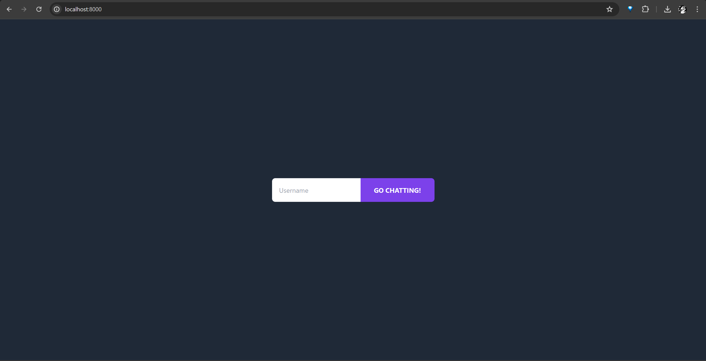
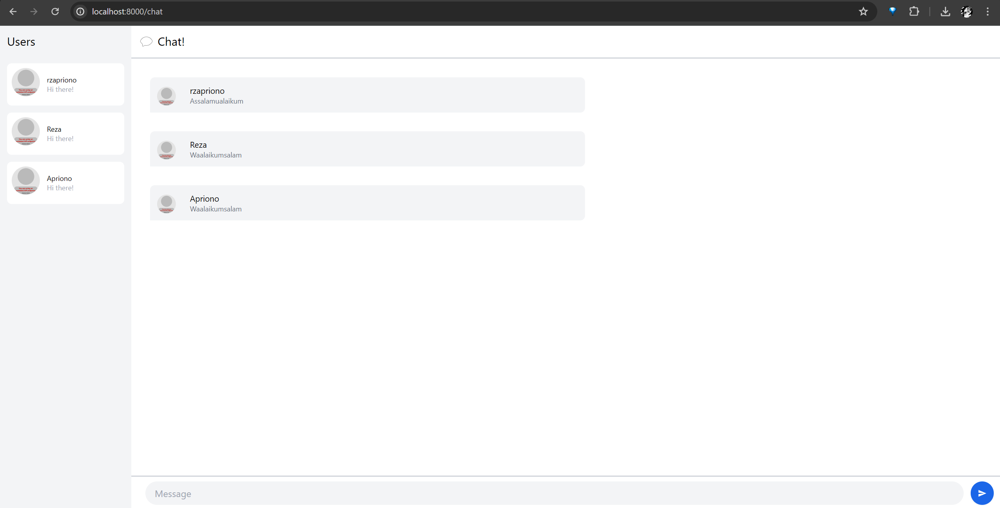
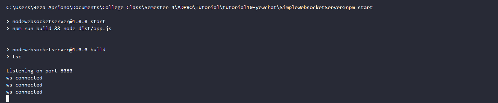
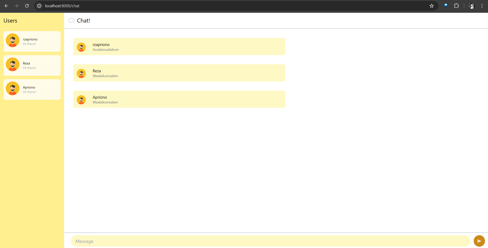

# 3.1: Original code

# 3.2. Add some creativities to the webclient

Di sini saya melakukan perubahan terhadap penggunaan warna dari chat page menjadi memiliki tema warna kuning. Selain itu, saya mengganti avatar menjadi avatar yang memiliki background berwarna kuning agar selaras dengan tema warnanya. Saya melakukannya dengan melampirkan link ke gambar avatar tersebut. Kemudian, saya juga menambahkan hover effect saat hover ke arah tombol send.